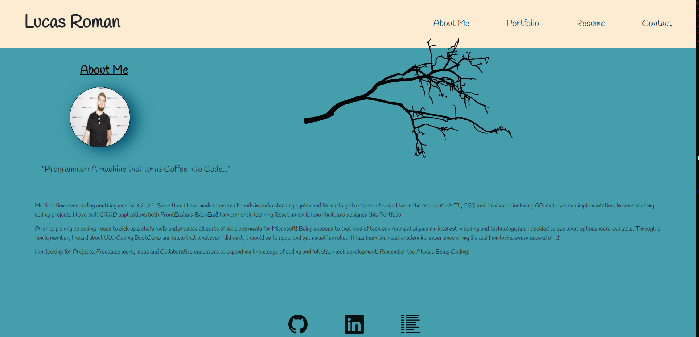
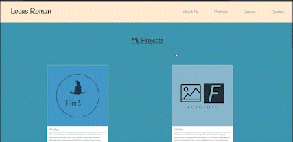
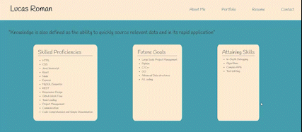
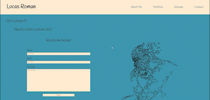

# React-Portfolio

## Table of Contents
   1. [License](#license)
   2. [Project-Description](#description)
   3. [Installation-Guide](#installation-guide)
   4. [Project-Usage](#usage)
   5. [Project-Contributors](#contributors)
   6. [Project-Tests](#tests)
   7. [Links](#links)
   8. [Mock-Ups](#mock-ups)
   9. [Questions](#questions-contact-me-at)
--- 
## [License](./LICENSE)

---
## Description 
    A custom designed portfolio that showcases what I've learend since I began coding a just 3 months ago. The contact portion actually works by using emailJs. Currently building an api to manage this for me directly. 
---
## Installation-Guide
    This is a react app. Fork over the repo and run `npm i`. Then `npm run start` which will run a locally hosted version of my portfolio. Feel free to use this a template for your own! Though make certain to switch the email handling in the contact component.  
---
## Usage 
    A custom self-desinged site to display my work and growth since first coding.  
---
## Contributors
    n/a
---
## Tests
    n/a
---
## Links
https://secret-eyrie-61205.herokuapp.com/
---
https://github.com/remotemana/React-Portfolio
## Mock-Ups

---

---

---

---
## Questions? Contact Me at...
lucas.e.roman@gmail.com | [github.com](https://github.com/remotemana)
